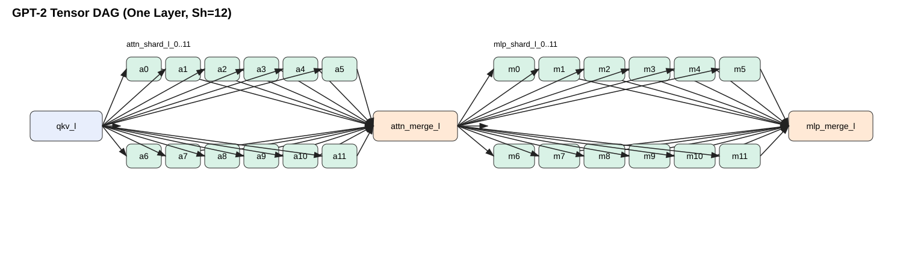
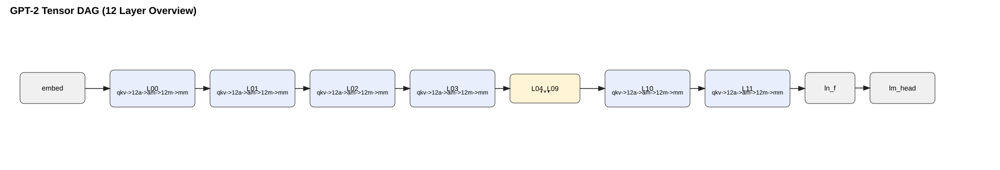

# gpt2-dag

GPT-2 is an early decoder-only Transformer-based LLM and a predecessor to current-generation GPT models.
For the original model details, see *Language Models are Unsupervised Multitask Learners* (Radford et al., 2019):
https://cdn.openai.com/better-language-models/language_models_are_unsupervised_multitask_learners.pdf

This repository is based on the Hugging Face GPT-2 implementation:
https://github.com/huggingface/transformers/blob/main/src/transformers/models/gpt2/modeling_gpt2.py

This repo contains a tensor-DAG implementation of GPT-2 (Sh=12 shards/layer), with:
- exact-functionality parity tests against Hugging Face GPT-2 code
- measured compute and communication profiling via `dagprofiler`
- DAGBench workflow export (`prefill` and `decode`)
- multi-node deployment planning scripts

## Where the DAG GPT-2 code lives

If you are looking for the actual DAG implementation, start here:

- `src/gpt2_dag/tensor_dag.py`
  - defines `GPT2TensorDAGLMHeadModel` (the DAG-ized GPT-2)
- `src/gpt2_dag/dagprofiler_workflow.py`
  - defines explicit `dagprofiler` tasks/edges for Sh=12 tensor DAG
- `src/gpt2_dag/export_dagbench.py`
  - exports measured DAG profiles into DAGBench workflow files
- `src/gpt2_dag/deployment.py`
  - deployment mapping (`pipeline`, `tensor`, `saga`)
- `src/gpt2_dag/worker_runtime.py`
  - worker entrypoint for per-node execution plans

More detail: `docs/architecture.md`

## DAG illustrations

Layer-level DAG (Sh=12):



12-layer overview:



Regenerate figures:

```powershell
python scripts/render_dag_figures.py
```

## Functional-equivalence guarantee

The DAG model (`GPT2TensorDAGLMHeadModel`) uses the same weights and the same GPT-2 block equations as Hugging Face GPT-2, but executes each layer through explicit tensor-sharded DAG steps:
- `qkv -> attn_shard_* -> attn_merge -> mlp_shard_* -> mlp_merge`

Parity tests verify:
- exact state_dict equality
- exact logits and cache equality on prefill and decode
- exact token-by-token greedy generation equivalence
- multiple prompt/decode shape coverage

## Run parity tests

```powershell
$env:PYTHONPATH = "src"
pytest -q tests/test_equivalence.py
```

## Run profiling + DAGBench export

```powershell
python run_pipeline.py --prompt-len 128 --decode-context-len 128 --repeats 9 --warmup 2 --shards 12
```

Outputs:
- `artifacts/profiles/gpt2_tensor_sh12_prefill_aggregated.json`
- `artifacts/profiles/gpt2_tensor_sh12_decode_aggregated.json`
- `artifacts/dagbench_workflows/ml_pipelines/gpt2_tensor_sh12_prefill/*`
- `artifacts/dagbench_workflows/ml_pipelines/gpt2_tensor_sh12_decode/*`

`run_pipeline.py` also mirrors generated workflows into local DAGBench:
- `<dagbench_root>/workflows/ml_pipelines/gpt2_tensor_sh12_prefill`
- `<dagbench_root>/workflows/ml_pipelines/gpt2_tensor_sh12_decode`

Set the mirror target explicitly with:

```powershell
python run_pipeline.py --mirror-dagbench /path/to/dagbench/workflows
```

## Multi-node deployment (split across nodes)

Build a concrete node assignment and estimated schedule from measured profiles:

```powershell
python scripts/deploy_plan.py `
  --profile artifacts/profiles/gpt2_tensor_sh12_decode_aggregated.json `
  --num-nodes 8 `
  --strategy tensor `
  --bandwidth-mbps 100 `
  --out artifacts/deployment/decode_k8_tensor.json
```

This outputs:
- `assignment` (`task -> node`)
- `node_task_order` (per-node runbook)
- estimated makespan/communication

Deployment details and strategy guide: `docs/deployment.md`

## SAGA-based mapping (network-aware)

You can also generate task-to-node mapping with SAGA, using a compute-network description file.

Pipeline:
- `gpt2-dag` model/tasks -> `dagprofiler` measured DAG
- measured DAG + `compute_network_input` -> `SAGA scheduler`
- output mapping: what task runs on which node, with scheduled start/end times

Example:

```powershell
python scripts/deploy_plan.py `
  --profile artifacts/profiles/gpt2_tensor_sh12_decode_aggregated.json `
  --strategy saga `
  --network-file docs/examples/compute_network_example.yaml `
  --scheduler heft `
  --out artifacts/deployment/decode_saga_heft.json
```

Scheduler support is dynamic:
- Any scheduler class discoverable from your installed `saga.schedulers` package can be used.
- You can also pass an explicit scheduler class path, e.g.:
  - `--scheduler saga.schedulers.heft:HeftScheduler`
  - `--scheduler mypkg.schedulers:MyCustomScheduler`

List detected scheduler aliases:

```powershell
python scripts/deploy_plan.py --list-schedulers
```

## What code is shipped to each node?

All nodes run the same code package. The deployment plan provides per-node task lists.

- Shared code shipped to every node:
  - `src/gpt2_dag/tensor_dag.py`
  - `src/gpt2_dag/dagprofiler_workflow.py`
  - `src/gpt2_dag/worker_runtime.py`
- Node-specific assignment is in plan JSON:
  - `node_task_order` and `assignment`

Worker dry-run example:

```powershell
$env:PYTHONPATH = "src"
python -m gpt2_dag.worker_runtime --plan artifacts/deployment/decode_saga_heft.json --node rpi-a --dry-run
```

Contributor: Bhaskar Krishnamachari (USC)
